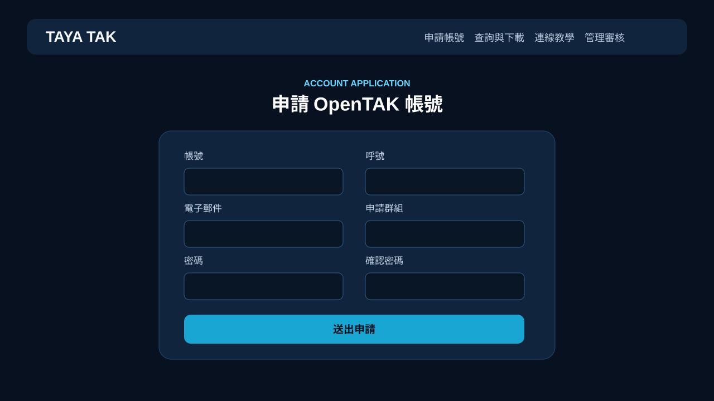
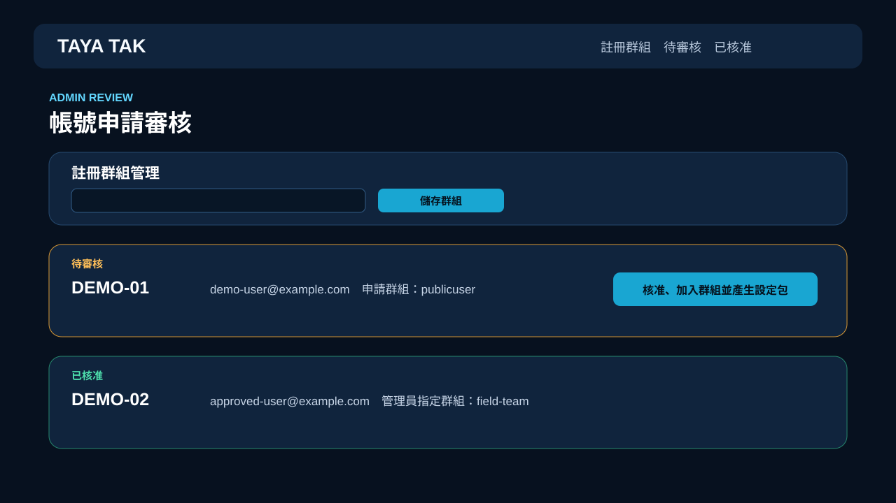

# Synology OpenTAKServer + Registration Portal

一個適合 Synology DSM Container Manager 的整合部署包：OpenTAKServer、Web UI、PostGIS、RabbitMQ、MediaMTX，以及帶有帳號申請、進度查詢、憑證下載、群組管理與管理員審核功能的繁體中文入口網站。

> [!IMPORTANT]
> 這是社群整合專案，不是 OpenTAKServer 官方發行版。OpenTAKServer 上游專案採 GPL-3.0；本儲存庫保留授權與原始碼，詳細來源見 [UPSTREAM.md](UPSTREAM.md)。

> [!NOTE]
> 本專案由 TAYA TAK 使用者與 OpenAI ChatGPT／Codex 協作產製、整理及除錯。AI 產製內容不代表 OpenAI 或 OpenTAKServer 官方背書；部署前仍應由管理者檢查程式碼、備份與安全設定。

## 頁面預覽

### 使用者註冊頁



### 管理員審核頁



## 最簡單部署方式

### DSM 圖形介面

1. 在 GitHub Releases 下載最新版 ZIP，解壓縮到 NAS，例如 `/volume1/docker/synology-opentak`。
2. 用 DSM 的「終端機與 SNMP」暫時啟用 SSH，登入後執行：

   ```bash
   cd /volume1/docker/synology-opentak
   chmod +x setup.sh
   ./setup.sh
   ```

3. 編輯 `.env`，只需先修改：

   ```dotenv
   OTS_FQDN=你的網域
   PUBLIC_HOST=你的網域
   PUBLIC_BASE_URL=https://你的網域
   ```

4. 開啟 **Container Manager → 專案 → 新增 → 建立 docker-compose.yml 專案**，選取此資料夾並啟動。
5. 等待 `opentakserver` 顯示健康後開啟：

   - OpenTAK Web UI：`http://NAS-IP:8080`
   - 註冊／查詢頁：`http://NAS-IP:8787`
   - 管理審核頁：`http://NAS-IP:8787/admin`

`setup.sh` 只依賴 DSM 內建的 shell、OpenSSL 與 sed，會自動建立資料目錄和資料庫強密碼；容器首次啟動時會自行處理資料目錄權限。註冊入口的 Flask/Fernet 金鑰會自動生成並保存在 `data/register/.register-secrets`。

### SSH 一行啟動

完成 `.env` 設定後：

```bash
docker compose up -d --build
```

檢查狀態：

```bash
docker compose ps
docker compose logs -f opentakserver register
```

## DSM 反向代理建議

在 **控制台 → 登入入口 → 進階 → 反向代理伺服器** 建立：

| 用途 | 外部來源 | 內部目的 |
|---|---|---|
| OpenTAK Web | `https://tak.example.com` | `http://127.0.0.1:8080` |
| 註冊與管理 | `https://register.example.com` | `http://127.0.0.1:8787` |

請使用 DSM 憑證功能配置 HTTPS。ATAK SSL CoT 預設使用 `8089`；憑證註冊預設使用 `8446`。

## 註冊入口功能

- 使用者申請帳號、呼號、電子郵件及群組
- 公開群組下拉選單與自訂群組申請
- 使用申請帳密查詢審核狀態
- 核准後產生並下載 ATAK 設定包
- 管理員以 OpenTAKServer 管理員帳密登入審核
- 建立群組、加入 IN/OUT 群組方向及後續指派群組
- 可選 SMTP 通知與設定包附件寄送
- CSRF、速率限制、短效管理工作階段及安全 Cookie

SMTP 為選配。未設定 `SMTP_HOST` 時，核准與設定包下載仍可正常使用，只會在管理頁顯示郵件未寄出的提示。

## 自訂品牌

不需要修改程式碼，只要在 `.env` 調整：

```dotenv
BRAND_NAME=你的 TAK 服務名稱
BRAND_SHORT=T
BRAND_TAGLINE=你的服務說明
BRAND_PRIMARY_COLOR=#3dd6e8
BRAND_ACCENT_COLOR=#ffba4a
BRAND_LOGO_URL=/static/custom-logo.svg
SUPPORT_LABEL=支持本專案
SUPPORT_URL=https://你的支持連結
```

將 Logo 放到 `register/static/custom-logo.svg`；留空 `BRAND_LOGO_URL` 會顯示文字圖示，留空 `SUPPORT_URL` 則隱藏支持連結。預設值保留 TAYA TAK 與 PayPal.Me/tayashot。

## 使用 ChatGPT 自行修改

你可以下載或 Fork 本儲存庫，再把需求交給 ChatGPT／Codex 協助修改。建議一次只處理一項功能，要求 AI 先讀取 `README.md`、`SECURITY.md`、`UPSTREAM.md` 與相關程式碼，修改後執行語法、Compose 結構與敏感資料檢查。

可直接使用以下提示詞：

```text
請協助修改這個 OpenTAKServer DSM Docker Fork。
先閱讀 README.md、SECURITY.md、UPSTREAM.md 和相關程式碼，只修改我指定的功能。
保留 GPL-3.0、上游來源、Docker 快速部署方式與現有資料相容性。
不得讀取、提交或輸出 .env、密碼、私鑰、憑證、資料庫、實際使用者資料或 ATAK 設定包。
完成後請檢查 Python／Shell 語法、docker-compose.yml 結構、git diff 與敏感資訊，並列出所有變更。

本次需求：［在這裡填寫要修改的功能］
```

若要讓 AI 協助現有 NAS，請優先提供已去識別化的錯誤訊息與設定範例，不要提供真實帳密、OTP、私鑰或完整生產資料。

## 更新與備份

升級前先備份整個 `data/`：

```bash
docker compose down
tar -czf opentak-backup-$(date +%F).tar.gz data
docker compose pull
docker compose up -d --build
```

請不要把備份、`.env`、憑證、SQLite/PostgreSQL 資料或 ATAK 設定包提交到 GitHub。

## 授權與上游規範

- 本儲存庫依 GPL-3.0 提供對應原始碼與修改內容。
- 上游名稱與商標僅用於描述相容性，不表示官方背書。
- 重新散布修改版本時，請保留 `LICENSE`、上游著作權聲明與原始碼取得方式。
- 請遵守所在地法令、組織資安政策與 OpenTAKServer 官方文件。

## 支持

如果這個 DSM 整合包對你有幫助，可以透過 [PayPal.Me/tayashot](https://paypal.me/tayashot) 支持維護。
